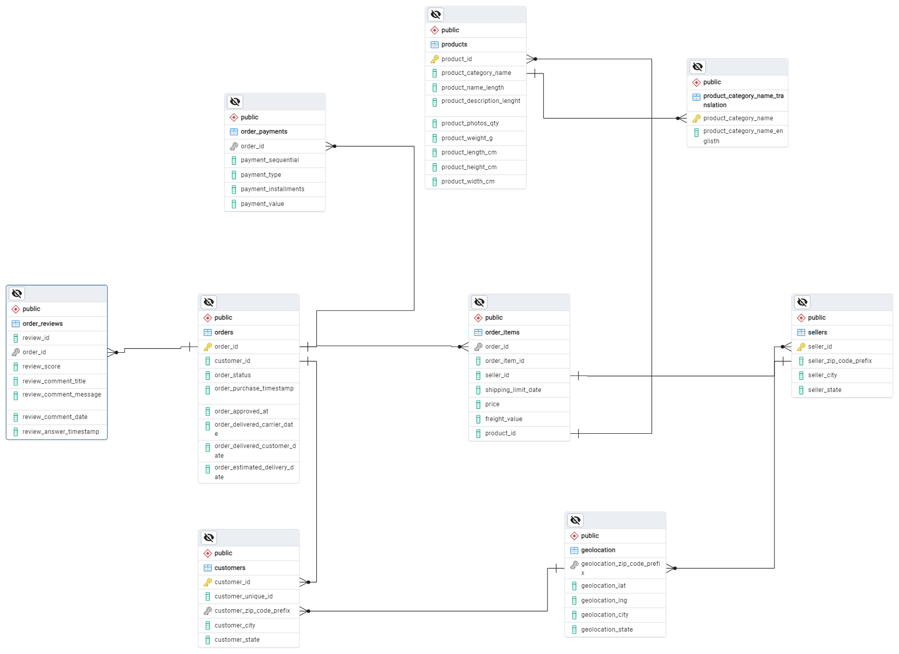

# Data Visualization Assignment 1

## Company
Olist E-commerce Platform

## Project Overview
Olist is a Brazilian e-commerce platform that connects small businesses to marketplaces. This project analyzes customer behavior, sales performance, and operational metrics to provide insights for business growth and optimization. The analytics focus on customer segmentation, order patterns, payment methods, and geographical distribution of sales.

## How to Run the Project
1. Clone this repository
3. Set up PostgreSQL database and import the dataset(https://www.kaggle.com/datasets/olistbr/brazilian-ecommerce)
4. Run the Python script: `python main.py`

## Database Schema

